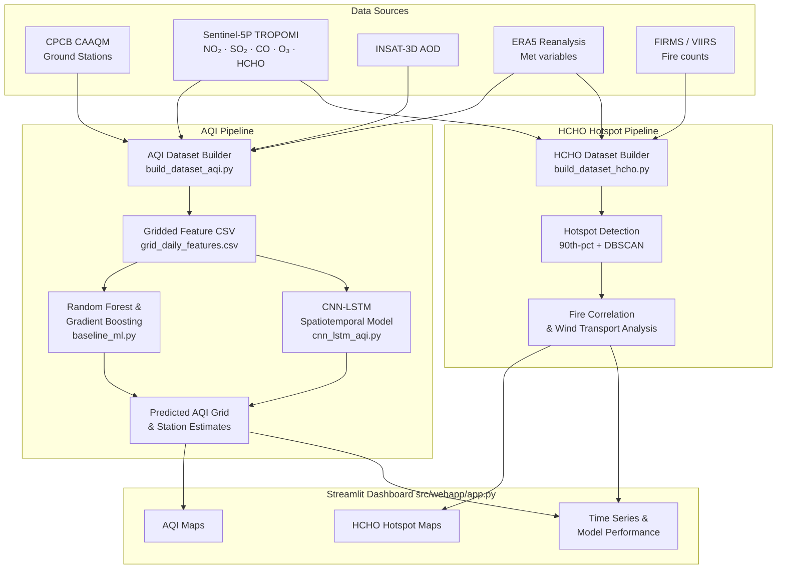

# ISRO Hackathon — Surface AQI & HCHO Hotspot Detection over India

**Problem Statement (ISRO SIH 2024):**
*"Development of Surface AQI & Identification of HCHO Hotspots over India using Satellite Data"*

---

## Overview

This repository implements a two-objective ML/GIS pipeline that fuses multi-source
satellite observations, reanalysis data, and CPCB ground measurements to:

1. **Predict and map surface AQI** over India without relying on dense ground-station
   coverage — using TROPOMI satellite columns, INSAT-3D AOD, and ERA5 reanalysis as
   predictors with Random Forest, Gradient Boosting, and CNN-LSTM models.

2. **Detect HCHO hotspots linked to biomass burning** — identifying seasonal patterns
   of elevated formaldehyde from TROPOMI HCHO, correlating with FIRMS fire counts,
   and mapping wind-driven transport over India.

A **7-page Streamlit dashboard** integrates all outputs for interactive exploration.

---

## Objectives

| # | Objective | Approach |
|---|-----------|----------|
| 1 | Predict surface AQI (PM2.5, overall AQI) | Satellite + met features → RF / GBM / CNN-LSTM → gridded AQI maps |
| 2 | Detect HCHO hotspots from biomass burning | TROPOMI HCHO + FIRMS fire → 90th-pct flagging + DBSCAN clustering + wind transport |

---

## Architecture Diagram



---

## Data Sources

| Source | Variables | Access |
|--------|-----------|--------|
| [CPCB CAAQM](https://airquality.cpcb.gov.in) | PM2.5, PM10, NO₂, SO₂, O₃, CO | Public portal; `download_cpcb.py` |
| [Sentinel-5P TROPOMI](https://developers.google.com/earth-engine/datasets/catalog/sentinel-5p) | NO₂, SO₂, CO, O₃, HCHO columns | Google Earth Engine / DLR |
| [INSAT-3D AOD](https://www.mosdac.gov.in) | Aerosol optical depth 550 nm | MOSDAC login required |
| [ERA5 Reanalysis](https://cds.climate.copernicus.eu) | T2m, RH2m, u10, v10, TP, SP, BLH | CDS API key required |
| [NASA FIRMS](https://firms.modaps.eosdis.nasa.gov) | MODIS/VIIRS fire pixel counts | MAP_KEY required |

---

## Repository Structure

```
isro-aqi-hcho/
├── README.md
├── requirements.txt
├── env_example.yml
├── config/
│   ├── paths.yaml              # Data directory paths and grid bbox
│   ├── aqi_training.yaml       # Model architecture and training config (V2)
│   └── hcho_hotspot.yaml       # Hotspot detection parameters
├── data/
│   ├── README.md               # Dataset schemas and download recipe
│   ├── raw/                    # Downloaded source data (gitignored)
│   ├── interim/                # Grid-aligned intermediates
│   └── processed/              # Final model-ready datasets
├── notebooks/
│   ├── 01_explore_cpcb.ipynb                  # CPCB data exploration
│   ├── 02_explore_satellite_reanalysis.ipynb  # Satellite feature analysis
│   ├── 03_train_baseline_and_cnn_lstm.ipynb   # Model training & evaluation
│   └── 04_hcho_hotspots_and_fire.ipynb        # HCHO hotspot analysis
├── src/
│   ├── data/
│   │   ├── grid_definition.py        # 0.1° India grid
│   │   ├── download_cpcb.py
│   │   ├── download_tropomi.py
│   │   ├── download_insat_aod.py
│   │   ├── download_reanalysis.py
│   │   ├── download_firms_fire.py
│   │   ├── build_dataset_aqi.py      # AQI dataset builder (--synthetic flag)
│   │   └── build_dataset_hcho.py     # HCHO dataset builder (--synthetic flag)
│   ├── features/
│   │   ├── make_features_aqi.py
│   │   └── make_features_hcho.py
│   ├── models/
│   │   ├── baseline_ml.py            # RF & GBM with GridSearchCV (V2)
│   │   ├── cnn_lstm_aqi.py           # CNN-LSTM architecture + AQIDataset
│   │   ├── train_aqi.py              # Training loop + hparam sweep (V2)
│   │   └── evaluate_aqi.py           # Evaluation & plot generation
│   ├── utils/
│   │   ├── aqi_calculator.py         # Official CPCB Indian AQI formula
│   │   └── logging_utils.py          # Centralised logging setup (V2)
│   ├── visualization/
│   │   ├── plot_maps.py
│   │   ├── plot_time_series.py
│   │   └── plot_hotspots.py
│   └── webapp/
│       └── app.py                    # Streamlit dashboard (7 pages)
├── models/
│   ├── baseline/                     # Trained RF/GBM .joblib files
│   └── cnn_lstm/                     # best_model.pt checkpoints
├── scripts/
│   ├── run_train_aqi.sh
│   └── run_hcho_hotspots.sh
└── logs/                             # Training log files (gitignored)
```

---

## Installation

### Option A — pip (recommended on Replit or plain Python ≥ 3.11)
```bash
pip install -r requirements.txt
```

### Option B — conda
```bash
conda env create -f env_example.yml
conda activate isro-aqi-hcho
```

### API credentials
See `data/README.md` for setting up CDS, GEE, MOSDAC, and FIRMS keys.

---

## Step-by-Step Usage

### 0 — Start the dashboard immediately (no data needed)
```bash
cd isro-aqi-hcho
streamlit run src/webapp/app.py
```
The dashboard auto-generates synthetic demo data on first launch.

### 1 — Generate synthetic demo data for notebooks & training
```bash
cd isro-aqi-hcho
python -m src.data.build_dataset_aqi --synthetic
python -m src.data.build_dataset_hcho --synthetic
```

### 2 — (Optional) Download real data
```bash
python -m src.data.download_cpcb   --start_date 2019-01-01 --end_date 2022-12-31
python -m src.data.download_tropomi --start_date 2019-01-01 --end_date 2022-12-31
python -m src.data.download_reanalysis --start_date 2019-01-01 --end_date 2022-12-31
python -m src.data.download_firms_fire --start_date 2019-01-01 --end_date 2022-12-31
python -m src.data.build_dataset_aqi    # without --synthetic uses real downloads
python -m src.data.build_dataset_hcho
```

### 3 — Train baseline models
```bash
python -m src.models.baseline_ml \
    --input data/processed/aqi_training_dataset.csv \
    --output_dir models/baseline

# With hyperparameter search:
python -m src.models.baseline_ml --hparam_search
```

### 4 — Train CNN-LSTM
```bash
# Smoke-test (synthetic, fast)
python -m src.models.train_aqi --synthetic

# Full training
python -m src.models.train_aqi --config config/aqi_training.yaml

# Hyperparameter sweep (synthetic)
python -m src.models.train_aqi --hparam_sweep
```

### 5 — Run Jupyter notebooks
```bash
jupyter lab notebooks/
```
All notebooks work with synthetic data out of the box.

---

## Model Details

### Baseline Models
| Model | Library | Key params |
|-------|---------|------------|
| Random Forest | scikit-learn | 200 trees, max_depth=15, temporal split |
| Gradient Boosting | scikit-learn | 200 trees, depth=6, lr=0.05 |

- Features: 13 satellite + met variables (TROPOMI, INSAT AOD, ERA5)
- Train split: 2019–2021 · Test split: 2022
- Saved as `.joblib` files; metrics logged to `baseline_results.csv`

### CNN-LSTM
| Component | Architecture |
|-----------|-------------|
| Input | `(B, T=7, C=13, H=30, W=30)` |
| SpatialEncoder | 2× Conv2D + BN + ReLU (32→64 filters) |
| LSTM | 2-layer, 128 hidden units |
| FC Head | 64 → H×W flat output |
| Output | `(B, H, W)` — predicted PM2.5 grid |

- Training: Adam + ReduceLROnPlateau, early stopping (patience=10)
- Automatic GPU acceleration (CUDA if available)

---

## HCHO Hotspot Methodology

1. **Aggregation** — daily TROPOMI HCHO columns are snapped to the 0.1° grid
2. **Percentile flagging** — cells above the 90th seasonal percentile are marked
3. **Clustering** — DBSCAN (ε=1.5 grid cells, min_samples=4) merges contiguous
   hotspot cells into labelled regions
4. **Fire correlation** — Pearson-r between HCHO and FIRMS fire counts at lags
   0–3 days; post-monsoon (Oct–Nov) consistently shows the highest correlations
   in Punjab-Haryana and northeast India crop-residue burning zones
5. **Wind transport** — ERA5 u10/v10 quivers are overlaid on hotspot maps to
   illustrate downwind transport of biomass burning emissions

---

## Limitations & Future Improvements

- **Spatial resolution** — 0.1° grid (~11 km) may miss city-scale gradients;
  a 0.01° product from planned INSAT-3DS could address this
- **Temporal coverage** — demonstration uses 2019–2022; extending to 2014–present
  (full TROPOMI era) would improve seasonality robustness
- **Vertical resolution** — no aerosol layer height information; mixing height
  from ERA5 BLH is a coarse proxy
- **Uncertainty quantification** — conformal prediction intervals or MC-dropout
  for CNN-LSTM are not yet implemented
- **Additional pollutants** — PM10, NH₃, and Pb are not currently modelled
- **Near-real-time** — the pipeline is batch-oriented; operationalising it for
  daily NRT AQI estimates would require an automated scheduler and live API feeds
